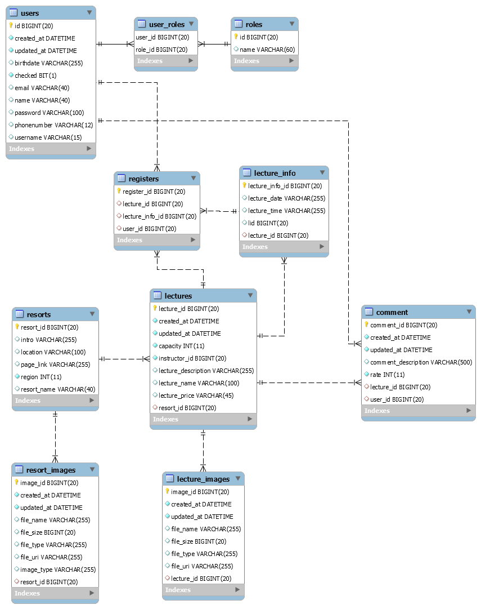

# GetSKI

## 만든 사람들

SSAFY 2기 서울 3반 4조

- 김민호 [@mhKim](https://lab.ssafy.com/mhKim)
- 김은영 [@youngslife](https://lab.ssafy.com/youngslife)
- 김지희 [@514kim](https://lab.ssafy.com/514kim)
- 박성호 [@ParkSungHo](https://lab.ssafy.com/ParkSungHo)
- 신광식 [@mel1015](https://lab.ssafy.com/mel1015)

## 기획의도

  스키장에 대한 정보가 한정적이고 대부분 공식 사이트에 의지하지만 이마저 제대로 관리가 되고. 있지 않는 실정. 또한 스키 강습에 관한 정보는 현장에서 확인 가능하거나 유선으로 예약해야하는 경우가 대부분.

  이를 보완하기 위해 겟스키는 전국에 있는 대한민국 스키장에 대한 위치, 요금, 슬로프 등 정보를 한곳에서 제공합니다.

  또한 강습 예약 서비스를 통해 강습을 열고 싶은 강사 유저들에게 보다 넓은 강습의 기회를 제공하고, 강습에 대한 후기 정보를 통해 수강을 원하는 유저들이 보다 객관적인 정보를 바탕으로 강습을 선택할 수 있는 기회를 제공합니다. 

## 기술 스택

## 기능

### 회원가입

1. 사용자 구분
   - Tutee
   - Tutor

### 마이페이지

1. 공통 기능
   - 자신의 등록 정보 확인 및 수정
 2. 일반 사용자
      - 예약한 강습 목록
      - 수강 이력
 3. 강사
      - 강의 등록

### 메인 페이지

1. **지도**

   - 전국 => 지역 => 지역 내 스키장 순으로 클릭 시 점차 확대되며 지도에 표시
   - 지도를 구현 성공하면 표지 만들지 말자

2. **추천 강습**

3. **지역별 스키장**

4. **후기**

   

### 스키장 상세 페이지

1. **스키장 정보**
   - 스키장 이미지
   - 스키장 상세 정보
   - 스키장명, 위치, 이용요금(리프트, 렌탈), 전경사진, 슬로프맵
2. **강습 정보**
   - 해당 스키장에서 진행되는 강습 리스트 => 클릭 시 강습 상세 페이지로

### 강습 상세 페이지

1. **달력 기능**
   - 예약 가능한 날짜 표시
   - 해당 날짜 선택 시 선택 가능한 강습 시간, 가격, 인원(11/20) 등 정보 표시
2. **강의 정보**
   - 강의 상세 설명, 이미지
3. **후기**
   - 해당 강의에 대한 후기를 댓글 형식으로 평점 등록

## ERD

-   ERD

